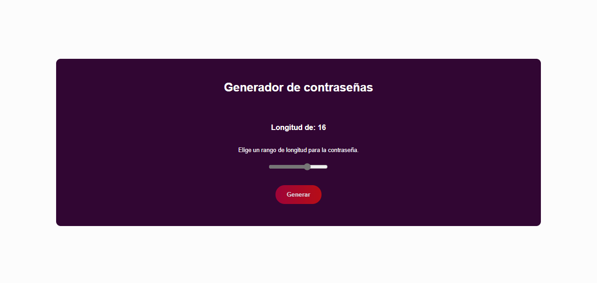
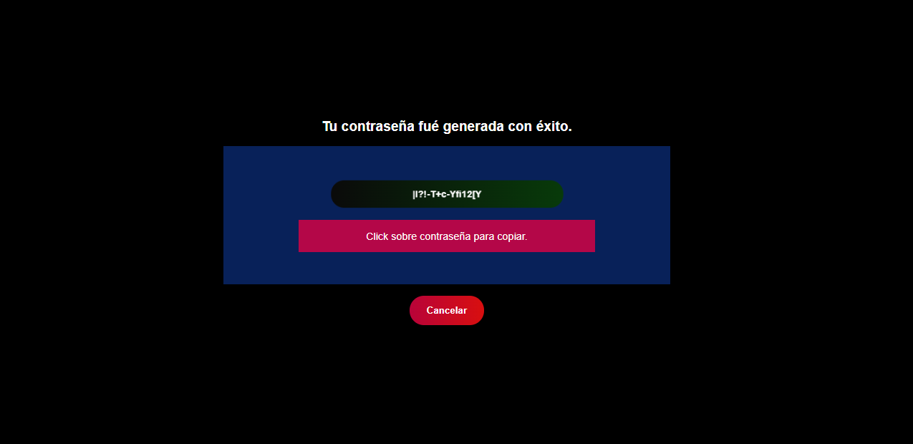
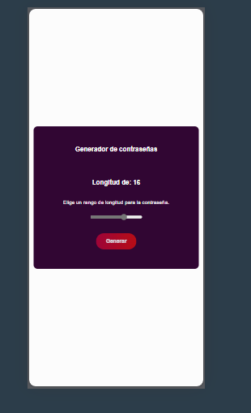

# Mi Proyecto

Este es un generador de contraseñas desarrollado con HTML, CSS, y JavaScript.

## Descripción

El proyecto permite a los usuarios seleccionar la longitud de la contraseña a través de un control deslizante de rango. Una vez generada, la contraseña se muestra en una ventana modal donde se puede copiar para su uso o cancelar la operación.

## Captura de Pantalla

## Cómo usar

1. Selecciona la longitud de la contraseña.
2. Haz clic en "Generar".
3. Copia la contraseña generada desde la ventana modal.
